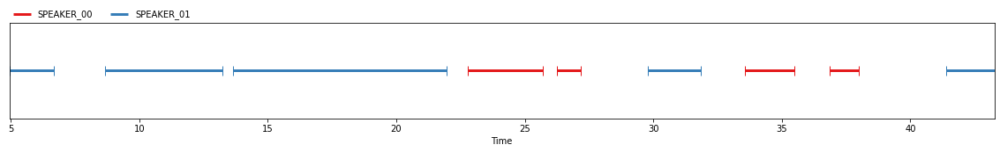
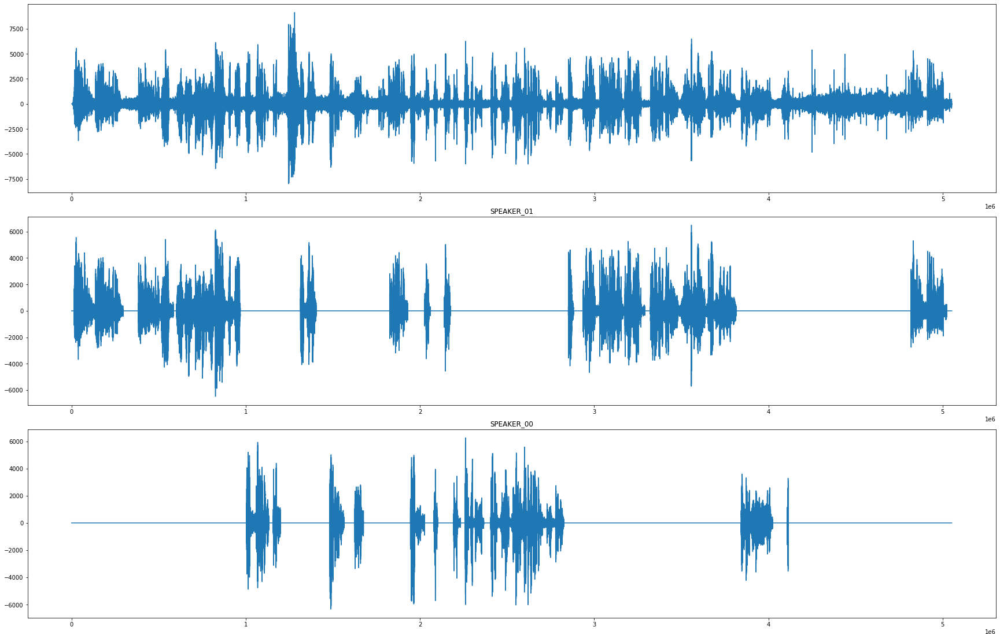
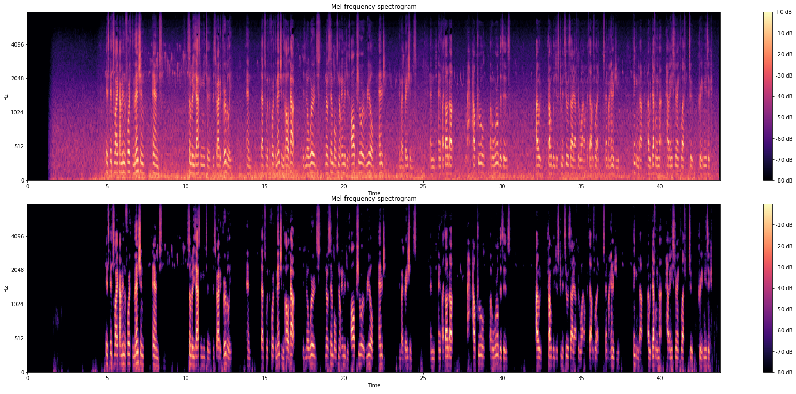
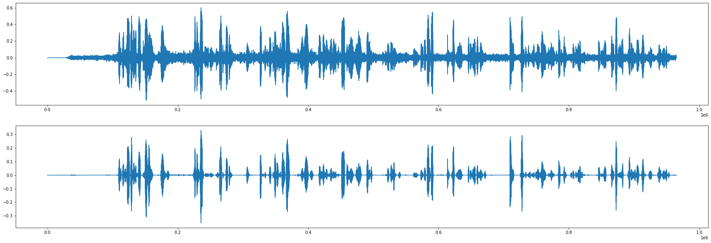

# <div align="center">Audio processing</div>
## <div align="center">Extracting human speech from YouTube videos</div>

The goal is to download video from YouTube, extract audio and process the audio in a way when only speech without any noise is kept.

### Download audio from Youtube

To download and extract audio from YouTube videos use ``yt_download.py`` script and pass direct link as an arguments. Several links can be passed at once.

```sh
python ./yt_download.py https://www.youtube.com/watch?v=MY5NspwaVgk https://www.youtube.com/watch?v=ngcgkRjV8XU https://www.youtube.com/watch?v=5Zmh5hbgHFI
```

### Extracting human speech

To extract human speech, run the ``main.py`` script. Several audio files can be passed at once.

* 1st argument - value of pause in human speech (in seconds);
* 2nd - link to an audio file.

```sh
python ./main.py 1.5 ./yt_download/clueless_clip_driving.wav
```

There are several stages of processing the audio:

#### **Voice diarization**

<a href="https://github.com/pyannote/pyannote-audio" title="Pyannote.audio">Pyannote.audio</a> library is used.

Voice diarization is a process of detecting human speech in an audio and giving to each detected piece of speech an individual speaker id.

Note: It is the most time-consuming process in the script.

<p align="center"></p>
<div align="center">Timeline showing different speakers in an audio.</div>

<p align="center"></p>
<div align="center">Timeline showing different speakers in an audio.</div>

#### **Noise reduction**

<a href="https://github.com/timsainb/noisereduce" title="Noisereduce">Noisereduce</a> library is used.

Noise reduction process extracts only human speech from the audio.

<p align="center"></p>
<div align="center">Spectre before and after human speech extraction.</div>

<p align="center"></p>
<div align="center">Audio timeseries before and after human speech extraction.</div>


#### **Cut audio by a certain inverval**

Before running the script it is available to specify the maximum value of pause in seconds between human speech which will be considered as a single audio file. If the gap between the human speech of the same person is bigger than specified, the speech will be separated into several audio files.

As a result, audio files of a human speech will be stored in a ``./processed_audio`` folder with each individual speaker id and file id.
